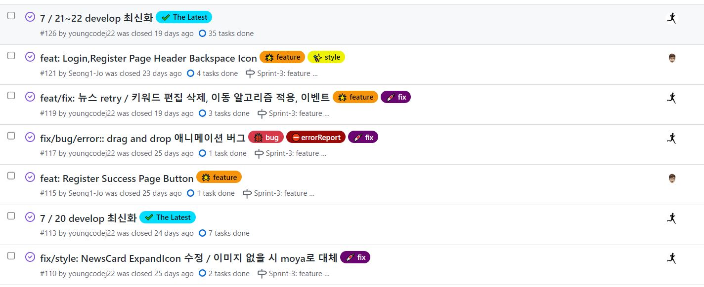
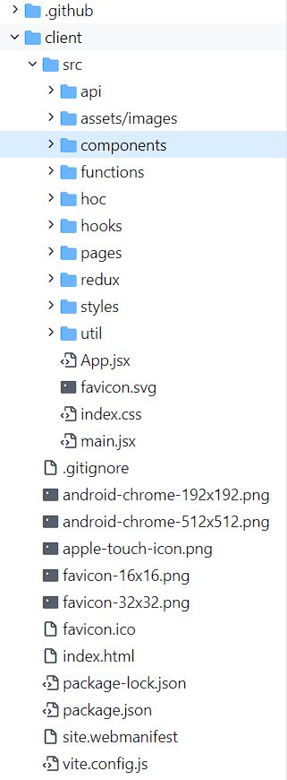
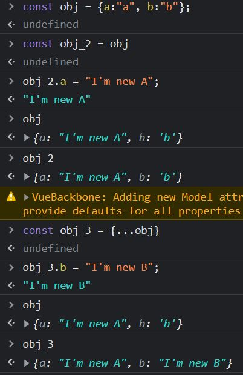
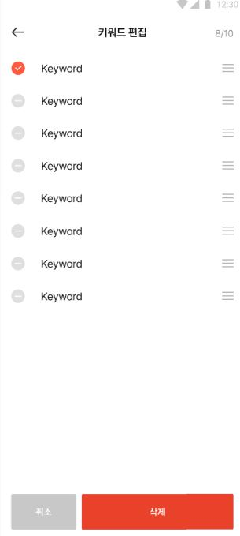
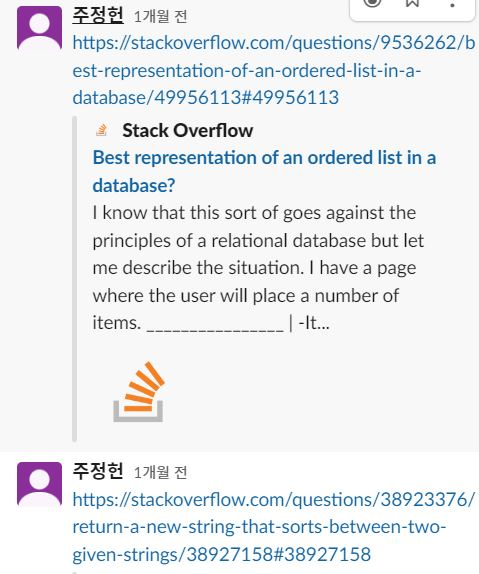

# 개요

패스트캠퍼스 MGS 과정에서 진행한 기업연계 프로젝트. 패캠 UI/UX 과정 팀과 기업 측 백엔드 개발자와의 협업.

# 목차

1. 프로젝트 세팅

- 1-1. Vite vs CRA
- 1-2. 기술 스택
- 1-3. Convention
- 1-4. 폴더 구성

2. 각 코드에서 발생한 문제와 해결 과정

# 내용

# 1. 프로젝트 세팅

### 1-1. Vite vs CRA

- CRA: Webpack(module bundler) 기반의 React Boilerplate를 제공
- Vite: 새로운 bundler, CRA와 같이 Boilerplate 제공

패캠 과정 동안 CRA를 사용하면서 dev-server를 띄우는 속도가 느린 것을 경험하였다. 그래서 Vite를 선택하였다.

#### Vite를 선택

1. 기존의 bundling

- `entry > route > module > bundle > server ready`
- 모든 파일이 번들링을 한 이후에 서버가 시작된다.
- 즉! entry를 시작으로 다수의 module을 bundle(묶다)을 하고 Server가 시작되는 것이다.

2. Vite

> The good news is that modern browsers have started to support module functionality natively, and this is what this article is all about. This can only be a good thing — browsers can optimize loading of modules, making it more efficient than having to use a library and do all of that extra client-side processing and extra round trips.

- 위 글은 MDN의 설명이다.
- `server ready (HTTP request) > entry (Dynamic import, code split point) > route > module`
- 즉! 브라우저가 ES Module을 지원함에 따라서 일반적인 번들링 과정을 생략한다. 또한 ESM 기반의 HMR API를 제공함으로써 애플리케이션을 다시 시작하지 않고도 일부 컨텐츠만 갱신할 수 있는 장점이 있다고 Vite 공식 문서에서 설명하고 있다.

- [Vite](https://vitejs-kr.github.io/guide/#overview)
- [MDN:JS module](https://developer.mozilla.org/en-US/docs/Web/JavaScript/Guide/Modules)
- [참고 블로그-eddie-sunny](https://eddie-sunny.tistory.com/107)
- [참고 블로그-Eamon](https://velog.io/@eamon3481/Vite-%EB%8A%94-Webpack%EC%9D%84-%EB%8C%80%EC%B2%B4-%EA%B0%80%EB%8A%A5%ED%95%A0%EA%B9%8C)

<br />

### 1-2. 기술 스택

- Vite
- React
  - react-redux
  - react-router-dom
  - react-cookie
  - react-highlight-words
  - react-hook-form
- Redux
  - redux-toolkit
  - redux-persist
- axios
- styled-components
- libraries
  - date-fns
  - dnd-kit (drag and drop)
- API Test Tool
  - ThunderClient (vscode extension)

#### ✏️ 알게 된 점

React에서 사용할 다양한 drag and drop 라이브러리를 찾아보다가 경고 문구들을 보게되었다. 프로젝트에서 나중을 생각하여 `React 18버전`을 사용하게 되었는데 여러 라이브러리들에서 버전에 대한 이슈가 있었다. 그렇게 계속 찾아보다가 `dnd-kit`이라는 것을 찾게 되어 버전이슈를 해결하였다. (버전은 낮추는 방안도 있었지만 나중을 생각하여 18버전을 유지하게되었다.)

<center>


</center>

<br />

### 1-3. Convention

- Slack
  - 팀원들에게 공지할 내용을 작성 후 공유
- Open Kakaotalk
  - 팀원들과 소통을 위한 채널
- Github
  - Issue, Label, Milestone, project, PullRequest Template 등을 설정하여 팀원들과 상황 공유

#### Commit

- prefix: 파일명
  (줄바꿈 아래) 아래 코드 수정한 부분 설명
- feat: 기능 개발 관련
- fix: 오류 개선 / 버그 패치
- refactor: feat에 코드 수정
- docs: 문서화 작업
  ex) docs: UPDATE README.md
- style: css style 작업
- test: test 관련 (테스트코드, 리펙토링 테스트 코드 추가)
- conf: 환경설정 관련, 빌드 업무 수정, 패키지 매니저, 폴더트리, 파일이름 변경
- build: 빌드 관련
- 각 prefix에는 `ADD/UPDATE/DELETE`를 사용하여 예를 들어 `feat: UPDATE [파일명]`을 제목에 적고 상세 내용을 설명에 적는다.

#### Issue

<center>

</center>

#### ☹️ 문제

commit, issue convention이 복잡했던 것인지 팀원들이 시간이 촉박해서 그랬던 것인지는 모르겠으나 convention을 지키지 않고 `feat: 작업내용` 식으로 작성한 경우가 많았다.

#### ✏️ 개선 할 점

commit message를 적는 convention을 더 직관적이고 간소화할 필요가 있다고 생각하였다.

<br />

### 1-4. 폴더 구성

<center>

</center>

- api
  - baseUrl.js에 `axios.create({baseURL:""})`을 설정하여 loginApi, searchApi 등으로 분리하여 사용
- assets/images
  - 프로젝트에서 사용하는 `.svg` 또는 images 파일들을 `vite.config.js`에서 `alias`설정을 통해 사용
- components
  - pages에서 종속된 component를 제외하고 공통으로 사용되는 component만 여기에 두었다.
  - 팀원들의 의견을 받아 이렇게 설정하였지만 프로젝트가 끝난 이후 이것이 큰 오류 였음을 알게되었다. 다음 페이지에서 따로 설명을 하도록 하겠다.
- hoc
  - AccessToken, UserCheck 파일을 hoc로 만들어서 pages와 components에서 연결하여 사용
- hooks
  - infinite scroll, 검색창에서 많은 데이터를 빠르게 보여주기 위한 hook 등의 적용
- pages
  - main, login, error 등, 페이지에 해당하는 부분을 폴더 별로 관리
  - 또한 해당 폴더에서 종속되어 사용할 component를 이 곳에 저장
- redux
  - redux-toolkit을 활용하여 필요한 파트별로 Slice를 만들어서 사용.
- styles
  - 각 component, page에 해당하는 style을 폴더로 관리.
  - `vite.config.js`에서 `alias`를 설정하여 `path`설정을 최소화하였다.
- util
  - session, 데이터 filter처리하는 부분, 기타 helper function 개념으로 사용할 코드들을 관리
- 그 외
  - main.jsx
    - redux store를 prop으로 주입
    - redux-persist 설정을 prop으로 주입
    - styled-components theme를 prop으로 주입
  - App.jsx
    - 해당 페이지별로 `route`설정.
  - index.css
    - reset.css를 적용
  - vite.config.js
    - `alias`를 적극 활용하여, api부터 util까지 모든 path를 설정

#### ☹️ 문제

팀원들의 의견을 받아서 pages에 종속된 component는 각 pages의 폴더로 관리하기로 했으나 해당 component가 종속될지 다른 곳에서 쓰일지 미리 계획하지 못해 섞여버린 것이 큰 문제였다.

#### ✏️ 개선 할 점

아무래도 pages와 components 역할을 완전히 분리하여 pages는 해당 페이지에 연결만을 하는 것이 더 좋을 것 같다고 생각하였다.

<br>

# 2. 각 코드에서 발생한 문제와 해결 과정

## API

```js
// keywordListApi.js
import clientServer from './baseUrl'

// 즐겨찾기 한 뉴스 키워드 가져오기
export const getKeywords = async accessToken => {
  try {
    const response = await clientServer({
      url: 'preferTerms/reports',
      headers: { Authorization: `Bearer ${accessToken}` },
      transformResponse: [
        function (data) {
          const transformedData = JSON.parse(data)
          return transformedData.reports.map((item, id) => {
            item.id = id
            return item
          })
        },
      ],
    })

    if (response.status === 200) {
      const data = await response.data

      return data
    }
  } catch (e) {
    console.log(e)
  }
}

// 회원이 즐겨찾기한 뉴스 키워드 순서변경/삭제
export const updateListKeywords = async (json, accessToken) => {
  try {
    await clientServer({
      url: 'preferTerms/updateList',
      headers: {
        'Content-Type': `application/json`,
        Authorization: `Bearer ${accessToken}`,
      },
      method: 'post',
      data: json,
      transformRequest: [
        function (data) {
          const transformedData = data
          let temp = []
          temp = transformedData.termList.map(item => {
            delete item.id
            delete item.name
            delete item.paramValue
            delete item.exchange
            temp.push(item)
            return item
          })
          const sendJson = { termList: temp }
          data = JSON.stringify(sendJson)
          return data
        },
      ],
    })
  } catch (e) {
    console.log(e)
  }
}
```

#### ✏️ 문제 / 해결

1. 메인 페이지에서 News데이터에 대한 렌더링을 할 때 News를 가져오는 api(`getKeywords`)에 원하는 `key,value`가 존재하지 않아 고민하다가 `axios config` 설정 중에 `transformResponse`을 찾아서 설정하고 해결.

2. 회원이 즐겨찾기한 뉴스 키워드를 Drag and Drop으로 위치 변경을 할 수 있고 삭제 할 수 있다. 이 때, 서버에 전송할 json 형태와 newsItem에 들어있는 데이터가 일치 하지 않아서 `transformRequest`를 사용하여 처리하였다.

<br />
 
## Components

#### useState에 대한 생각

프로젝트를 진행하면서 state 변경 시 **객체**를 넘겨주는 방식들을 많이 경험하게 되었다. 예를 들어 아래와 같다.
번역 api를 불러와서 한글/영어를 번역할 때 해당 text를 `setTranslate`로 업데이트 시켜주는 과정들이다.

```js
const fetch = async newsId => {
  const response = await translateApi(newsId, accessToken)
  if (response.status === 200) {
    setTranslate(prev => [
      ...prev,
      {
        newsId,
        description: response.data.description,
        title: response.data.title,
      },
    ])
  } else if (response.status === 400) {
    setTranslate(prev => [
      ...prev,
      {
        newsId,
        description: 'description',
        title: response.data.title,
      },
    ])
  }
}

const handleTranslate = (e, newsId) => {
  if (userLogin) {
    // ...
    fetch(newsId)
  } else {
    // ...
  }
}
```

💡 이후 자연스럽게 React에서 제공하는 `useState()`에 대한 탐색?을 하고 싶어졌다. 아래는 검색을 통해 공부하게 된 자료이다. 그 중 일부만 코드를 소개하도록 하겠다.

```js
const MyReact = (function () {
  // state와 dependencies를 잡아두는 역할을 하는 변수.
  // 즉! closure 형태
  let _val, _deps

  return {
    render(Component) {
      const Comp = Component()
      Comp.render()
      return Comp
    },
    useEffect(callback, depArray) {
      const hasNoDeps = !depArray
      const hasChangedDeps = _deps
        ? !depArray.every((el, i) => el === _deps[i])
        : true
      if (hasNoDeps || hasChangedDeps) {
        callback()
        _deps = depArray
      }
    },
    useState(initialValue) {
      _val = _val || initialValue
      function setState(newVal) {
        _val = newVal
      }
      return [_val, setState]
    },
  }
})()
```

**우리는 해당 함수 종료 시 내부에 존재하던 변수에 접근할 수 없지만 closure형태로 state를 사용할 수 있다.**

- [Closure and useState](https://www.swyx.io/hooks/)

<br />

💡 또한 객체의 불변성에 대해서도 알아 둘 필요가 있었다. 아래 사진은 개발자도구에서 테스트해본 사진이다. Object는 참고 타입이다. 그렇기 때문에 그 변수가 같은 주소를 참고 있기 때문에 우리는 객체를 복사하여 사용할 필요가 있다.

<center>

</center>

<br />
 
## Util

아래 사진은 메인 페이지에서 `...`버튼을 클릭 시 즐겨찾기 한 키워드를 편집하는 페이지로 이동하는 버튼이다.

<center>



</center>

```js
// lexicographical ordering
// 사용자가 자신의 키워드 순서를 drag and drop 이벤트로 변경했을 때 해당 sequence 문자열로 순서에 맞게 자동 적용해주는 알고리즘
export const createTermSeq = editItemsLength => {
  function midString(prev, next) {
    let p, n, pos, str
    for (pos = 0; p === n; pos++) {
      p = pos < prev.length ? prev.charCodeAt(pos) : 96
      n = pos < next.length ? next.charCodeAt(pos) : 123
    }
    str = prev.slice(0, pos - 1)
    if (p === 96) {
      while (n === 97) {
        n = pos < next.length ? next.charCodeAt(pos++) : 123
        str += 'a'
      }
      if (n === 98) {
        str += 'a'
        n = 123
      }
    } else if (p + 1 === n) {
      str += String.fromCharCode(p)
      n = 123
      while ((p = pos < prev.length ? prev.charCodeAt(pos++) : 96) === 123) {
        str += 'z'
      }
    }
    return str + String.fromCharCode(Math.ceil((p + n) / 2))
  }

  // closure 형태로 기존 알고리즘을 변경
  let strings = []
  let innerFunc = function () {
    const createStringLoop = () => {
      strings = ['a', 'c']

      while (strings.length < editItemsLength) {
        let rnd = Math.floor(Math.random() * (strings.length - 1))
        strings.splice(rnd + 1, 0, midString(strings[rnd], strings[rnd + 1]))
      }
    }

    if (editItemsLength === 1) {
      strings = [...strings, 'a']
    } else if (editItemsLength === 2) {
      strings = [...strings, 'a', 'c']
    } else {
      createStringLoop()
    }
    return strings
  }

  return innerFunc()
}
```

#### ☹️ 문제

3번째 사진에서 볼수 있듯이 기업 백엔드 개발자 분이 **lexicographical ordering** 알고리즘을 이용하여 **이동하여 변경된 순서에 대한 sequence를 문자열로 넘겨 DB에서 `order by ASC`를 한다고 하였다.** `number` 타입으로 넘기면 안되냐고 물어봤지만 숫자는 0과 1사이에 소수점이 존재하여 DB에서 정렬하기가 어렵다는 말을 하셨다.

- [참고-1](https://stackoverflow.com/questions/38923376/return-a-new-string-that-sorts-between-two-given-strings/38927158#38927158)
- [참고-2](https://stackoverflow.com/questions/9536262/best-representation-of-an-ordered-list-in-a-database/49956113#49956113)

#### ✏️ 해결

결국 `Closure`개념을 도입하여 util함수를 만들고 키워드가 1개일 때, 2개 일때는 `a`또는 `a, c`로 값을 넣어주고 그 외 3개 이상은 `a, b , c`, `a, an, b, c` 이런 형태로 생성되게 알고리즘을 수정하여 만들어주었다. 그래서 서버에 다시 보낼 때는 이 알고리즘을 컴포넌트에서 `handleDrop`이라는 함수를 만들고 Drop하는 시점에 자동 바인딩이 되도록 만들었다.
